# ReadyOn Time-Off Sync Microservice

This microservice handles employee time-off requests within the ReadyOn ecosystem while synchronizing with an external Human Capital Management (HCM) system. The application ensures data integrity and uses Optimistic Concurrency Control (OCC) to prevent issues with double-spending or concurrent request corruption.

## Features

- **NestJS Architecture**: Built with modern, modular TypeScript.
- **SQLite Database**: Lightweight, configuration-free local storage configured via TypeORM.
- **Optimistic Concurrency Control (OCC)**: Prevents balance deductions from overlapping network calls.
- **Mock HCM External Service**: Includes an internal mock endpoint to simulate an external HR system with artificial network delays and chaos/resilience testing fallbacks.
- **Swagger Documentation**: Beautiful, interactive API documentation generated automatically.

## System Architecture & Saga Flow

The system implements the **Saga Pattern** coupled with **Optimistic Concurrency Control (OCC)** to ensure the local database stays perfectly synchronized with the external HCM without locking resources.

```mermaid
sequenceDiagram
    participant User
    participant LocalDB as SQLite (Local)
    participant Microservice as Time-Off Service
    participant HCM as External HCM

    User->>Microservice: POST /api/v1/balances/request
    Microservice->>LocalDB: Fetch Balance
    LocalDB-->>Microservice: available_days & version
    
    alt Insufficient Balance
        Microservice-->>User: 400 Bad Request
    else Sufficient Balance
        rect rgb(40, 40, 40)
            note right of Microservice: Saga Step 1: Local Reservation
            Microservice->>LocalDB: UPDATE balances SET days=days-X, version=version+1 WHERE version=Z
            LocalDB-->>Microservice: update_result
        end
        
        alt OCC Conflict (Concurrent Request)
            Microservice-->>User: 500 OptimisticLockVersionMismatchError
        else OCC Success
            Microservice->>LocalDB: INSERT time_off_requests (status: PENDING_HCM)
            
            rect rgb(40, 40, 40)
                note right of Microservice: Saga Step 2: External Execution
                Microservice->>HCM: POST /mock-hcm/deduct { requestId, days }
                HCM-->>Microservice: 200 OK or Error
            end
            
            alt HCM Success
                Microservice->>LocalDB: UPDATE time_off_requests (status: APPROVED)
                Microservice-->>User: 200 Success (APPROVED)
            else HCM Failure or Timeout
                rect rgb(40, 40, 40)
                    note right of Microservice: Saga Step 3: Compensating Transaction
                    Microservice->>LocalDB: UPDATE balances SET days=days+X
                    Microservice->>LocalDB: UPDATE time_off_requests (status: REFUNDED)
                end
                Microservice-->>User: 200 Success (REFUNDED)
            end
        end
    end
```



## Prerequisites

- Node.js (v18 or higher recommended)
- npm (Node Package Manager)

## Installation

Install the project dependencies:

```bash
npm install
```

## Running the Application

### Development Mode

To start the server in watch mode:

```bash
npm run start:dev
```

The server will start on `http://localhost:3000` and automatically restart whenever you modify your source files.

### Production Build

To compile and start the production build:

```bash
npm run build
npm run start:prod
```

## Exploring the API

Once the application is running, open your browser and navigate to:

```text
http://localhost:3000/api
```

This will bring up the interactive **Swagger OpenAPI Documentation**. From here, you can inspect the available schemas, payloads, and even trigger HTTP requests directly to the endpoints (e.g., `/api/v1/balances/request` or `/api/v1/balances/admin/batch-sync`).

## Testing

The project includes an extensive End-to-End (E2E) testing suite that sets up an in-memory database to validate edge cases and resilience.

### Run E2E Tests

```bash
npm run test:e2e
```

The e2e test suite (`test/balances.e2e-spec.ts`) covers:
1. **Happy Path**: Successful time-off requests syncing accurately to local storage.
2. **Overdraw Prevention**: Rejecting requests that exceed the available balance.
3. **Resilience / Chaos Testing**: Triggering an artificial 503 error on the mock server and ensuring the local balance remains securely untouched.
4. **Race Condition Prevention**: Firing precisely concurrent requests to validate the `@VersionColumn` database locks and optimistic versioning.

### Run Unit Tests (Optional)

```bash
npm run test
```
